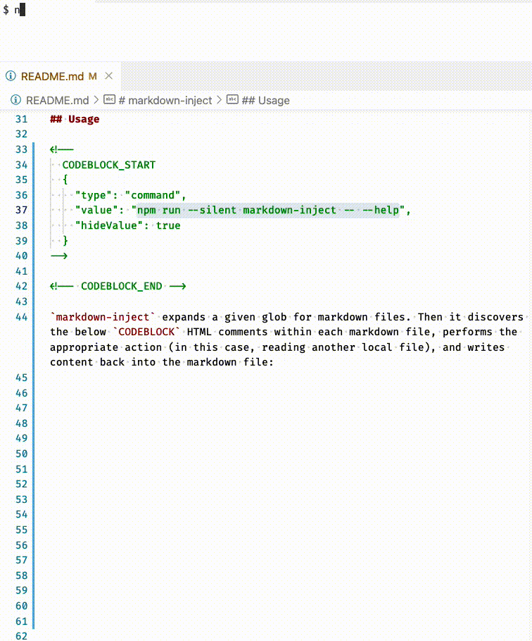

# markdown-inject

Add file or command output to markdown documents.



## Installation

`markdown-inject` is written in TypeScript and distributed as a node module on the npm ecosystem. It exposes a bin executable, making it a command line offering.

Download and invoke in one command:

```
npx markdown-inject
```

Local npm installation:

```
npm install markdown-inject --save-dev
```

or with Yarn:

```
yarn add markdown-inject --dev
```

Optionally, wire up `markdown-inject` to a git pre-commit hook tool like [husky](https://github.com/typicode/husky) to automatically update markdown injection as part of your workflow.

## Usage

> Note: `markdown-inject` takes no action during pull request builds in CI.

<!--
  CODEBLOCK_START
  {
    "type": "command",
    "value": "npm run --silent markdown-inject -- --help",
    "hideValue": true
  }
-->
<!-- prettier-ignore -->
~~~~~~~~~~bash
Usage: markdown-inject [options] <glob pattern | -a>

Examples:
  $ npx markdown-inject -a
  $ npx markdown-inject 'README.md'
  $ npx markdown-inject './**/*.{md,mdx}'

Add file or command output to markdown documents.

Options:
  -v, --version                   output the version number
  -a, --all                       applies a globPattern of './**/*.md'
                                  (default: false)
  -b, --block-prefix <prefix>     specifies the prefix for START and END HTML
                                  comment blocks (default: "CODEBLOCK")
  -n, --no-follow-symbolic-links  prevents globs from following symlinks
  -q, --quiet                     emits no console log statements (default:
                                  false)
  -e, --no-system-environment     prevents "command"s from receiving system
                                  environment
  -h, --help                      display help for command
~~~~~~~~~~

<!-- CODEBLOCK_END -->

`markdown-inject` expands a given glob for markdown files. Then it discovers the below `CODEBLOCK` HTML comments within each markdown file, performs the appropriate action (in this case, reading another local file), and writes content back into the markdown file:

{/* CODEBLOCK_START_USAGE {"ignore": true} */}

```
<!-- CODEBLOCK_START {"value": ".nvmrc"} -->
<!-- CODEBLOCK_END -->
```

<!-- CODEBLOCK_END_USAGE -->

```
{/* CODEBLOCK_START {"value": ".nvmrc"} -->
<!-- prettier-ignore -->
~~~~~~~~~~bash
File: .nvmrc

v20.10.0
~~~~~~~~~~

<!-- CODEBLOCK_END -->
```

Output is written between the CODEBLOCK_START and CODEBLOCK_END comments. Output includes:

- A prettier ignore comment introducing the output so that prettier does not further alter existing code.
- A markdown codeblock is opened with the language specified via configuration.
- The `<type>: <value>` line is included by default, labeling the output.
- The command or file output.

Executing commands follows a similar syntax:

```
<!-- CODEBLOCK_START {"value": "echo hello world", "type": "command"} -->
<!-- prettier-ignore -->
~~~~~~~~~~bash
$ echo hello world

hello world
~~~~~~~~~~

<!-- CODEBLOCK_END -->
```

You can hide the `<type>: <value>` comment from the generated output too:

```
<!-- CODEBLOCK_START {"value": "echo hello world", "type": "command", "hideValue": true} -->
<!-- prettier-ignore -->
~~~~~~~~~~bash
hello world
~~~~~~~~~~

<!-- CODEBLOCK_END -->
```

### Environment

System environment is automatically passed to `command`s:

<!--
  CODEBLOCK_START
  {
    "type": "command",
    "value": "echo \"My home directory is: $HOME\"",
    "environment": {
      "comment": "Be careful with these or you'll leak your actual home dir",
      "HOME": "/Users/me"
    }
  }
-->
<!-- prettier-ignore -->
~~~~~~~~~~bash
$ echo "My home directory is: $HOME"

My home directory is: /Users/me
~~~~~~~~~~

<!-- CODEBLOCK_END -->

In some scenarios, passing system environment to `command`s may be undesirable. This functionality can be disabled using the [`--no-system-environment` CLI flag](#usage). This creates output such as:

<!-- CODEBLOCK_START
  {
    "type": "command",
    "value": "echo \"My password is: $MY_PASSWORD\"",
    "environment": {
      "comment": "just in case?",
      "MY_PASSWORD": ""
    }
  }
-->
<!-- prettier-ignore -->
~~~~~~~~~~bash
$ echo "My password is: $MY_PASSWORD"

My password is:
~~~~~~~~~~

<!-- CODEBLOCK_END -->

Sometimes commands need a little extra nudging via environment to receive a usable output. Environment variables can be added using the `environment` key:

<!-- CODEBLOCK_START_EXAMPLE_PASSED_ENVIRONMENT {"ignore": true} -->

```
<!--
  CODEBLOCK_START
  {
    "type": "command",
    "value": "node ./deploy.js --dry-run",
    "environment": {
      "SKIP_PRECHECK": "true"
    }
  }
-->
<!-- CODEBLOCK_END -->
```

<!-- CODEBLOCK_END_EXAMPLE_PASSED_ENVIRONMENT -->

The `environment` key can also be used to overwrite system environment variables with example values:

```
<!--
  CODEBLOCK_START
  {
    "type": "command",
    "value": "echo \"My password is: $MY_PASSWORD\"",
    "environment": {
      "MY_PASSWORD": "<insert password here>"
    }
  }
-->
<!-- prettier-ignore -->
~~~~~~~~~~bash
$ echo "My password is: $MY_PASSWORD"

My password is: <insert password here>
~~~~~~~~~~

<!-- CODEBLOCK_END -->
```

Environment variables with values which follow bash variable naming rules will be substituted into the `command` environment whether or not `--no-system-environment` is enabled. This can be useful for re-introducing necessary environment variables that would be omitted by `--no-system-environment`:

<!-- CODEBLOCK_START_EXAMPLE_MAP_ENV {"ignore": true} -->

```
<!--
  CODEBLOCK_START
  {
    "type": "command",
    "value": "echo \"My home directory is: $HOME\nMy password is: $MY_PASSWORD\"",
    "environment": {
      "HOME": "$HOME"
    }
  }
-->
<!-- prettier-ignore -->
~~~~~~~~~~bash
$ echo "My home directory is: $HOME
My password is: $MY_PASSWORD"

My home directory is: /Users/me
My password is:
~~~~~~~~~~

<!-- CODEBLOCK_END -->
```

<!-- CODEBLOCK_END_EXAMPLE_MAP_ENV -->

## Codeblock Configuration

The `CODEBLOCK_START` HTML comment config block has the following properties:

| Name          | Type                  | Required | Default                                             | Description                                                    |
| ------------- | --------------------- | -------- | --------------------------------------------------- | -------------------------------------------------------------- |
| `value`       | `string`              | `true`   |                                                     | Command to execute or file to retrieve                         |
| `environment` | `object`              | `false`  | `{}`                                                | Run `command` executions with the given environment values     |
| `hideValue`   | `boolean`             | `false`  | `false`                                             | Do not display `File: foo.js` or `$ npx foo` on the first line |
| `language`    | `string`              | `false`  | `command`:&nbsp;`bash`, `file`:&nbsp;File extension | Syntax highlighting language                                   |
| `trim`        | `boolean`             | `false`  | `true`                                              | Trim whitespace from the ends of file or command output        |
| `type`        | `'command' \| 'file'` | `false`  | `'file'`                                            | Type of execution                                              |

## Contributing

See [CONTRIBUTING.md](/CONTRIBUTING.md) for more information.

## Similar Projects

- [embedme](https://github.com/zakhenry/embedme) - embed source files into markdown code blocks
- [mdsh](https://github.com/zimbatm/mdsh) - a similar tool but for the Rust ecosystem
